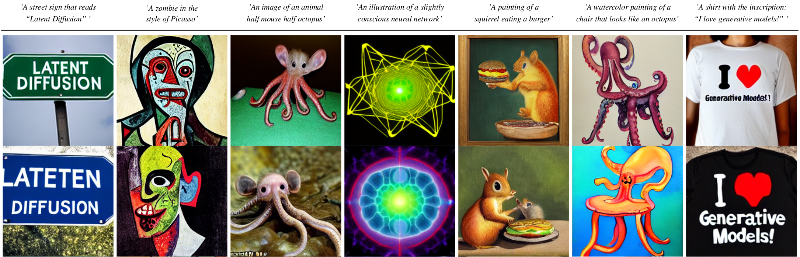

# Taming Transformers for High-Resolution Image Synthesis
##### CVPR 2021 (Oral)


[**Taming Transformers for High-Resolution Image Synthesis**](https://compvis.github.io/taming-transformers/)<br/>
[Patrick Esser](https://github.com/pesser)\*,
[Robin Rombach](https://github.com/rromb)\*,
[Björn Ommer](https://hci.iwr.uni-heidelberg.de/Staff/bommer)<br/>
\* equal contribution

**tl;dr** We combine the efficiancy of convolutional approaches with the expressivity of transformers by introducing a convolutional VQGAN, which learns a codebook of context-rich visual parts, whose composition is modeled with an autoregressive transformer.


[arXiv](https://arxiv.org/abs/2012.09841) | [BibTeX](#bibtex) | [Project Page](https://compvis.github.io/taming-transformers/)


### News
#### 2022
- More pretrained VQGANs (e.g. a f8-model with only 256 codebook entries) are available in our new work on [Latent Diffusion Models](https://github.com/CompVis/latent-diffusion).
- Added scene synthesis models as proposed in the paper [High-Resolution Complex Scene Synthesis with Transformers](https://arxiv.org/abs/2105.06458), see [this section](#scene-image-synthesis).
#### 2021
- Thanks to [rom1504](https://github.com/rom1504) it is now easy to [train a VQGAN on your own datasets](#training-on-custom-data).
- Included a bugfix for the quantizer. For backward compatibility it is
  disabled by default (which corresponds to always training with `beta=1.0`).
  Use `legacy=False` in the quantizer config to enable it.
  Thanks [richcmwang](https://github.com/richcmwang) and [wcshin-git](https://github.com/wcshin-git)!
- Our paper received an update: See https://arxiv.org/abs/2012.09841v3 and the corresponding changelog.
- Added a pretrained, [1.4B transformer model](https://k00.fr/s511rwcv) trained for class-conditional ImageNet synthesis, which obtains state-of-the-art FID scores among autoregressive approaches and outperforms BigGAN.
- Added pretrained, unconditional models on [FFHQ](https://k00.fr/yndvfu95) and [CelebA-HQ](https://k00.fr/2xkmielf).
- Added accelerated sampling via caching of keys/values in the self-attention operation, used in `scripts/sample_fast.py`.
- Added a checkpoint of a [VQGAN](https://heibox.uni-heidelberg.de/d/2e5662443a6b4307b470/) trained with f8 compression and Gumbel-Quantization. 
  See also our updated [reconstruction notebook](https://colab.research.google.com/github/CompVis/taming-transformers/blob/master/scripts/reconstruction_usage.ipynb). 
- We added a [colab notebook](https://colab.research.google.com/github/CompVis/taming-transformers/blob/master/scripts/reconstruction_usage.ipynb) which compares two VQGANs and OpenAI's [DALL-E](https://github.com/openai/DALL-E). See also [this section](#more-resources).
- We now include an overview of pretrained models in [Tab.1](#overview-of-pretrained-models). We added models for [COCO](#coco) and [ADE20k](#ade20k).
- The streamlit demo now supports image completions.
- We now include a couple of examples from the D-RIN dataset so you can run the
  [D-RIN demo](#d-rin) without preparing the dataset first.
- You can now jump right into sampling with our [Colab quickstart notebook](https://colab.research.google.com/github/CompVis/taming-transformers/blob/master/scripts/taming-transformers.ipynb).

## Requirements
A suitable [conda](https://conda.io/) environment named `taming` can be created
and activated with:

```
conda env create -f environment.yaml
conda activate taming
```
## Overview of pretrained models
The following table provides an overview of all models that are currently available. 
FID scores were evaluated using [torch-fidelity](https://github.com/toshas/torch-fidelity).
For reference, we also include a link to the recently released autoencoder of the [DALL-E](https://github.com/openai/DALL-E) model. 
See the corresponding [colab
notebook](https://colab.research.google.com/github/CompVis/taming-transformers/blob/master/scripts/reconstruction_usage.ipynb)
for a comparison and discussion of reconstruction capabilities.

| Dataset  | FID vs train | FID vs val | Link |  Samples (256x256) | Comments
| ------------- | ------------- | ------------- |-------------  | -------------  |-------------  |
| FFHQ (f=16) | 9.6 | -- | [ffhq_transformer](https://k00.fr/yndvfu95) |  [ffhq_samples](https://k00.fr/j626x093) |
| CelebA-HQ (f=16) | 10.2 | -- | [celebahq_transformer](https://k00.fr/2xkmielf) | [celebahq_samples](https://k00.fr/j626x093) |
| ADE20K (f=16) | -- | 35.5 | [ade20k_transformer](https://k00.fr/ot46cksa) | [ade20k_samples.zip](https://heibox.uni-heidelberg.de/f/70bb78cbaf844501b8fb/) [2k] | evaluated on val split (2k images)
| COCO-Stuff (f=16) | -- | 20.4  | [coco_transformer](https://k00.fr/2zz6i2ce) | [coco_samples.zip](https://heibox.uni-heidelberg.de/f/a395a9be612f4a7a8054/) [5k] | evaluated on val split (5k images)
| ImageNet (cIN) (f=16) | 15.98/15.78/6.59/5.88/5.20 | -- | [cin_transformer](https://k00.fr/s511rwcv) | [cin_samples](https://k00.fr/j626x093) | different decoding hyperparameters |  
| |  | | || |
| FacesHQ (f=16) | -- |  -- | [faceshq_transformer](https://k00.fr/qqfl2do8)
| S-FLCKR (f=16) | -- | -- | [sflckr](https://heibox.uni-heidelberg.de/d/73487ab6e5314cb5adba/) 
| D-RIN (f=16) | -- | -- | [drin_transformer](https://k00.fr/39jcugc5)
| | |  | | || |
| VQGAN ImageNet (f=16), 1024 |  10.54 | 7.94 | [vqgan_imagenet_f16_1024](https://heibox.uni-heidelberg.de/d/8088892a516d4e3baf92/) | [reconstructions](https://k00.fr/j626x093) | Reconstruction-FIDs.
| VQGAN ImageNet (f=16), 16384 | 7.41 | 4.98 |[vqgan_imagenet_f16_16384](https://heibox.uni-heidelberg.de/d/a7530b09fed84f80a887/)  |  [reconstructions](https://k00.fr/j626x093) | Reconstruction-FIDs.
| VQGAN OpenImages (f=8), 256 | -- | 1.49 |https://ommer-lab.com/files/latent-diffusion/vq-f8-n256.zip |  ---  | Reconstruction-FIDs. Available via [latent diffusion](https://github.com/CompVis/latent-diffusion).
| VQGAN OpenImages (f=8), 16384 | -- | 1.14 |https://ommer-lab.com/files/latent-diffusion/vq-f8.zip  |  ---  | Reconstruction-FIDs. Available via [latent diffusion](https://github.com/CompVis/latent-diffusion)
| VQGAN OpenImages (f=8), 8192, GumbelQuantization | 3.24 | 1.49 |[vqgan_gumbel_f8](https://heibox.uni-heidelberg.de/d/2e5662443a6b4307b470/)  |  ---  | Reconstruction-FIDs.
| | |  | | || |
| DALL-E dVAE (f=8), 8192, GumbelQuantization | 33.88 | 32.01 | https://github.com/openai/DALL-E | [reconstructions](https://k00.fr/j626x093) | Reconstruction-FIDs.


## Running pretrained models

The commands below will start a streamlit demo which supports sampling at
different resolutions and image completions. To run a non-interactive version
of the sampling process, replace `streamlit run scripts/sample_conditional.py --`
by `python scripts/make_samples.py --outdir <path_to_write_samples_to>` and
keep the remaining command line arguments. 

To sample from unconditional or class-conditional models, 
run `python scripts/sample_fast.py -r <path/to/config_and_checkpoint>`.
We describe below how to use this script to sample from the ImageNet, FFHQ, and CelebA-HQ models, 
respectively.

### S-FLCKR


You can also [run this model in a Colab
notebook](https://colab.research.google.com/github/CompVis/taming-transformers/blob/master/scripts/taming-transformers.ipynb),
which includes all necessary steps to start sampling.

Download the
[2020-11-09T13-31-51_sflckr](https://heibox.uni-heidelberg.de/d/73487ab6e5314cb5adba/)
folder and place it into `logs`. Then, run
```
streamlit run scripts/sample_conditional.py -- -r logs/2020-11-09T13-31-51_sflckr/
```

### ImageNet


Download the [2021-04-03T19-39-50_cin_transformer](https://k00.fr/s511rwcv)
folder and place it into logs.  Sampling from the class-conditional ImageNet
model does not require any data preparation. To produce 50 samples for each of
the 1000 classes of ImageNet, with k=600 for top-k sampling, p=0.92 for nucleus
sampling and temperature t=1.0, run

```
python scripts/sample_fast.py -r logs/2021-04-03T19-39-50_cin_transformer/ -n 50 -k 600 -t 1.0 -p 0.92 --batch_size 25   
```

To restrict the model to certain classes, provide them via the `--classes` argument, separated by 
commas. For example, to sample 50 *ostriches*, *border collies* and *whiskey jugs*, run

```
python scripts/sample_fast.py -r logs/2021-04-03T19-39-50_cin_transformer/ -n 50 -k 600 -t 1.0 -p 0.92 --batch_size 25 --classes 9,232,901   
```
We recommended to experiment with the autoregressive decoding parameters (top-k, top-p and temperature) for best results.  

### FFHQ/CelebA-HQ

Download the [2021-04-23T18-19-01_ffhq_transformer](https://k00.fr/yndvfu95) and 
[2021-04-23T18-11-19_celebahq_transformer](https://k00.fr/2xkmielf) 
folders and place them into logs. 
Again, sampling from these unconditional models does not require any data preparation.
To produce 50000 samples, with k=250 for top-k sampling,
p=1.0 for nucleus sampling and temperature t=1.0, run

```
python scripts/sample_fast.py -r logs/2021-04-23T18-19-01_ffhq_transformer/   
```
for FFHQ and  

```
python scripts/sample_fast.py -r logs/2021-04-23T18-11-19_celebahq_transformer/   
```
to sample from the CelebA-HQ model.
For both models it can be advantageous to vary the top-k/top-p parameters for sampling.

### FacesHQ


Download [2020-11-13T21-41-45_faceshq_transformer](https://k00.fr/qqfl2do8) and
place it into `logs`. Follow the data preparation steps for
[CelebA-HQ](#celeba-hq) and [FFHQ](#ffhq). Run
```
streamlit run scripts/sample_conditional.py -- -r logs/2020-11-13T21-41-45_faceshq_transformer/
```

### D-RIN


Download [2020-11-20T12-54-32_drin_transformer](https://k00.fr/39jcugc5) and
place it into `logs`. To run the demo on a couple of example depth maps
included in the repository, run

```
streamlit run scripts/sample_conditional.py -- -r logs/2020-11-20T12-54-32_drin_transformer/ --ignore_base_data data="{target: main.DataModuleFromConfig, params: {batch_size: 1, validation: {target: taming.data.imagenet.DRINExamples}}}"
```

To run the demo on the complete validation set, first follow the data preparation steps for
[ImageNet](#imagenet) and then run
```
streamlit run scripts/sample_conditional.py -- -r logs/2020-11-20T12-54-32_drin_transformer/
```

### COCO
Download [2021-01-20T16-04-20_coco_transformer](https://k00.fr/2zz6i2ce) and
place it into `logs`. To run the demo on a couple of example segmentation maps
included in the repository, run

```
streamlit run scripts/sample_conditional.py -- -r logs/2021-01-20T16-04-20_coco_transformer/ --ignore_base_data data="{target: main.DataModuleFromConfig, params: {batch_size: 1, validation: {target: taming.data.coco.Examples}}}"
```

### ADE20k
Download [2020-11-20T21-45-44_ade20k_transformer](https://k00.fr/ot46cksa) and
place it into `logs`. To run the demo on a couple of example segmentation maps
included in the repository, run

```
streamlit run scripts/sample_conditional.py -- -r logs/2020-11-20T21-45-44_ade20k_transformer/ --ignore_base_data data="{target: main.DataModuleFromConfig, params: {batch_size: 1, validation: {target: taming.data.ade20k.Examples}}}"
```

## Scene Image Synthesis

Scene image generation based on bounding box conditionals as done in our CVPR2021 AI4CC workshop paper [High-Resolution Complex Scene Synthesis with Transformers](https://arxiv.org/abs/2105.06458) (see talk on [workshop page](https://visual.cs.brown.edu/workshops/aicc2021/#awards)). Supporting the datasets COCO and Open Images.

### Training
Download first-stage models [COCO-8k-VQGAN](https://heibox.uni-heidelberg.de/f/78dea9589974474c97c1/) for COCO or [COCO/Open-Images-8k-VQGAN](https://heibox.uni-heidelberg.de/f/461d9a9f4fcf48ab84f4/) for Open Images.
Change `ckpt_path` in `data/coco_scene_images_transformer.yaml` and `data/open_images_scene_images_transformer.yaml` to point to the downloaded first-stage models.
Download the full COCO/OI datasets and adapt `data_path` in the same files, unless working with the 100 files provided for training and validation suits your needs already.

Code can be run with
`python main.py --base configs/coco_scene_images_transformer.yaml -t True --gpus 0,`
or
`python main.py --base configs/open_images_scene_images_transformer.yaml -t True --gpus 0,`

### Sampling 
Train a model as described above or download a pre-trained model:
 - [Open Images 1 billion parameter model](https://drive.google.com/file/d/1FEK-Z7hyWJBvFWQF50pzSK9y1W_CJEig/view?usp=sharing) available that trained 100 epochs. On 256x256 pixels, FID 41.48±0.21, SceneFID 14.60±0.15, Inception Score 18.47±0.27. The model was trained with 2d crops of images and is thus well-prepared for the task of generating high-resolution images, e.g. 512x512.
 - [Open Images distilled version of the above model with 125 million parameters](https://drive.google.com/file/d/1xf89g0mc78J3d8Bx5YhbK4tNRNlOoYaO) allows for sampling on smaller GPUs (4 GB is enough for sampling 256x256 px images). Model was trained for 60 epochs with 10% soft loss, 90% hard loss. On 256x256 pixels, FID 43.07±0.40, SceneFID 15.93±0.19, Inception Score 17.23±0.11.
 - [COCO 30 epochs](https://heibox.uni-heidelberg.de/f/0d0b2594e9074c7e9a33/)
 - [COCO 60 epochs](https://drive.google.com/file/d/1bInd49g2YulTJBjU32Awyt5qnzxxG5U9/) (find model statistics for both COCO versions in `assets/coco_scene_images_training.svg`)

When downloading a pre-trained model, remember to change `ckpt_path` in `configs/*project.yaml` to point to your downloaded first-stage model (see ->Training).

Scene image generation can be run with
`python scripts/make_scene_samples.py --outdir=/some/outdir -r /path/to/pretrained/model --resolution=512,512`


## Training on custom data

Training on your own dataset can be beneficial to get better tokens and hence better images for your domain.
Those are the steps to follow to make this work:
1. install the repo with `conda env create -f environment.yaml`, `conda activate taming` and `pip install -e .`
1. put your .jpg files in a folder `your_folder`
2. create 2 text files a `xx_train.txt` and `xx_test.txt` that point to the files in your training and test set respectively (for example `find $(pwd)/your_folder -name "*.jpg" > train.txt`)
3. adapt `configs/custom_vqgan.yaml` to point to these 2 files
4. run `python main.py --base configs/custom_vqgan.yaml -t True --gpus 0,1` to
   train on two GPUs. Use `--gpus 0,` (with a trailing comma) to train on a single GPU.

## Data Preparation

### ImageNet
The code will try to download (through [Academic
Torrents](http://academictorrents.com/)) and prepare ImageNet the first time it
is used. However, since ImageNet is quite large, this requires a lot of disk
space and time. If you already have ImageNet on your disk, you can speed things
up by putting the data into
`${XDG_CACHE}/autoencoders/data/ILSVRC2012_{split}/data/` (which defaults to
`~/.cache/autoencoders/data/ILSVRC2012_{split}/data/`), where `{split}` is one
of `train`/`validation`. It should have the following structure:

```
${XDG_CACHE}/autoencoders/data/ILSVRC2012_{split}/data/
├── n01440764
│   ├── n01440764_10026.JPEG
│   ├── n01440764_10027.JPEG
│   ├── ...
├── n01443537
│   ├── n01443537_10007.JPEG
│   ├── n01443537_10014.JPEG
│   ├── ...
├── ...
```

If you haven't extracted the data, you can also place
`ILSVRC2012_img_train.tar`/`ILSVRC2012_img_val.tar` (or symlinks to them) into
`${XDG_CACHE}/autoencoders/data/ILSVRC2012_train/` /
`${XDG_CACHE}/autoencoders/data/ILSVRC2012_validation/`, which will then be
extracted into above structure without downloading it again.  Note that this
will only happen if neither a folder
`${XDG_CACHE}/autoencoders/data/ILSVRC2012_{split}/data/` nor a file
`${XDG_CACHE}/autoencoders/data/ILSVRC2012_{split}/.ready` exist. Remove them
if you want to force running the dataset preparation again.

You will then need to prepare the depth data using
[MiDaS](https://github.com/intel-isl/MiDaS). Create a symlink
`data/imagenet_depth` pointing to a folder with two subfolders `train` and
`val`, each mirroring the structure of the corresponding ImageNet folder
described above and containing a `png` file for each of ImageNet's `JPEG`
files. The `png` encodes `float32` depth values obtained from MiDaS as RGBA
images. We provide the script `scripts/extract_depth.py` to generate this data.
**Please note** that this script uses [MiDaS via PyTorch
Hub](https://pytorch.org/hub/intelisl_midas_v2/). When we prepared the data,
the hub provided the [MiDaS
v2.0](https://github.com/intel-isl/MiDaS/releases/tag/v2) version, but now it
provides a v2.1 version. We haven't tested our models with depth maps obtained
via v2.1 and if you want to make sure that things work as expected, you must
adjust the script to make sure it explicitly uses
[v2.0](https://github.com/intel-isl/MiDaS/releases/tag/v2)!

### CelebA-HQ
Create a symlink `data/celebahq` pointing to a folder containing the `.npy`
files of CelebA-HQ (instructions to obtain them can be found in the [PGGAN
repository](https://github.com/tkarras/progressive_growing_of_gans)).

### FFHQ
Create a symlink `data/ffhq` pointing to the `images1024x1024` folder obtained
from the [FFHQ repository](https://github.com/NVlabs/ffhq-dataset).

### S-FLCKR
Unfortunately, we are not allowed to distribute the images we collected for the
S-FLCKR dataset and can therefore only give a description how it was produced.
There are many resources on [collecting images from the
web](https://github.com/adrianmrit/flickrdatasets) to get started.
We collected sufficiently large images from [flickr](https://www.flickr.com)
(see `data/flickr_tags.txt` for a full list of tags used to find images)
and various [subreddits](https://www.reddit.com/r/sfwpornnetwork/wiki/network)
(see `data/subreddits.txt` for all subreddits that were used).
Overall, we collected 107625 images, and split them randomly into 96861
training images and 10764 validation images. We then obtained segmentation
masks for each image using [DeepLab v2](https://arxiv.org/abs/1606.00915)
trained on [COCO-Stuff](https://arxiv.org/abs/1612.03716). We used a [PyTorch
reimplementation](https://github.com/kazuto1011/deeplab-pytorch) and include an
example script for this process in `scripts/extract_segmentation.py`.

### COCO
Create a symlink `data/coco` containing the images from the 2017 split in
`train2017` and `val2017`, and their annotations in `annotations`. Files can be
obtained from the [COCO webpage](https://cocodataset.org/). In addition, we use
the [Stuff+thing PNG-style annotations on COCO 2017
trainval](http://calvin.inf.ed.ac.uk/wp-content/uploads/data/cocostuffdataset/stuffthingmaps_trainval2017.zip)
annotations from [COCO-Stuff](https://github.com/nightrome/cocostuff), which
should be placed under `data/cocostuffthings`.

### ADE20k
Create a symlink `data/ade20k_root` containing the contents of
[ADEChallengeData2016.zip](http://data.csail.mit.edu/places/ADEchallenge/ADEChallengeData2016.zip)
from the [MIT Scene Parsing Benchmark](http://sceneparsing.csail.mit.edu/).

## Training models

### FacesHQ

Train a VQGAN with
```
python main.py --base configs/faceshq_vqgan.yaml -t True --gpus 0,
```

Then, adjust the checkpoint path of the config key
`model.params.first_stage_config.params.ckpt_path` in
`configs/faceshq_transformer.yaml` (or download
[2020-11-09T13-33-36_faceshq_vqgan](https://k00.fr/uxy5usa9) and place into `logs`, which
corresponds to the preconfigured checkpoint path), then run
```
python main.py --base configs/faceshq_transformer.yaml -t True --gpus 0,
```

### D-RIN

Train a VQGAN on ImageNet with
```
python main.py --base configs/imagenet_vqgan.yaml -t True --gpus 0,
```

or download a pretrained one from [2020-09-23T17-56-33_imagenet_vqgan](https://k00.fr/u0j2dtac)
and place under `logs`. If you trained your own, adjust the path in the config
key `model.params.first_stage_config.params.ckpt_path` of
`configs/drin_transformer.yaml`.

Train a VQGAN on Depth Maps of ImageNet with
```
python main.py --base configs/imagenetdepth_vqgan.yaml -t True --gpus 0,
```

or download a pretrained one from [2020-11-03T15-34-24_imagenetdepth_vqgan](https://k00.fr/55rlxs6i)
and place under `logs`. If you trained your own, adjust the path in the config
key `model.params.cond_stage_config.params.ckpt_path` of
`configs/drin_transformer.yaml`.

To train the transformer, run
```
python main.py --base configs/drin_transformer.yaml -t True --gpus 0,
```

## More Resources
### Comparing Different First Stage Models
The reconstruction and compression capabilities of different fist stage models can be analyzed in this [colab notebook](https://colab.research.google.com/github/CompVis/taming-transformers/blob/master/scripts/reconstruction_usage.ipynb). 
In particular, the notebook compares two VQGANs with a downsampling factor of f=16 for each and codebook dimensionality of 1024 and 16384, 
a VQGAN with f=8 and 8192 codebook entries and the discrete autoencoder of OpenAI's [DALL-E](https://github.com/openai/DALL-E) (which has f=8 and 8192 
codebook entries).


### Other
- A [video summary](https://www.youtube.com/watch?v=o7dqGcLDf0A&feature=emb_imp_woyt) by [Two Minute Papers](https://www.youtube.com/channel/UCbfYPyITQ-7l4upoX8nvctg).
- A [video summary](https://www.youtube.com/watch?v=-wDSDtIAyWQ) by [Gradient Dude](https://www.youtube.com/c/GradientDude/about).
- A [weights and biases report summarizing the paper](https://wandb.ai/ayush-thakur/taming-transformer/reports/-Overview-Taming-Transformers-for-High-Resolution-Image-Synthesis---Vmlldzo0NjEyMTY)
by [ayulockin](https://github.com/ayulockin).
- A [video summary](https://www.youtube.com/watch?v=JfUTd8fjtX8&feature=emb_imp_woyt) by [What's AI](https://www.youtube.com/channel/UCUzGQrN-lyyc0BWTYoJM_Sg).
- Take a look at [ak9250's notebook](https://github.com/ak9250/taming-transformers/blob/master/tamingtransformerscolab.ipynb) if you want to run the streamlit demos on Colab.

### Text-to-Image Optimization via CLIP
VQGAN has been successfully used as an image generator guided by the [CLIP](https://github.com/openai/CLIP) model, both for pure image generation
from scratch and image-to-image translation. We recommend the following notebooks/videos/resources:

 - [Advadnouns](https://twitter.com/advadnoun/status/1389316507134357506) Patreon and corresponding LatentVision notebooks: https://www.patreon.com/patronizeme
 - The [notebook]( https://colab.research.google.com/drive/1L8oL-vLJXVcRzCFbPwOoMkPKJ8-aYdPN) of [Rivers Have Wings](https://twitter.com/RiversHaveWings).
 - A [video](https://www.youtube.com/watch?v=90QDe6DQXF4&t=12s) explanation by [Dot CSV](https://www.youtube.com/channel/UCy5znSnfMsDwaLlROnZ7Qbg) (in Spanish, but English subtitles are available)


Text prompt: *'A bird drawn by a child'*

## Shout-outs
Thanks to everyone who makes their code and models available. In particular,

- The architecture of our VQGAN is inspired by [Denoising Diffusion Probabilistic Models](https://github.com/hojonathanho/diffusion)
- The very hackable transformer implementation [minGPT](https://github.com/karpathy/minGPT)
- The good ol' [PatchGAN](https://github.com/junyanz/pytorch-CycleGAN-and-pix2pix) and [Learned Perceptual Similarity (LPIPS)](https://github.com/richzhang/PerceptualSimilarity)

## BibTeX

```
@misc{esser2020taming,
      title={Taming Transformers for High-Resolution Image Synthesis}, 
      author={Patrick Esser and Robin Rombach and Björn Ommer},
      year={2020},
      eprint={2012.09841},
      archivePrefix={arXiv},
      primaryClass={cs.CV}
}
```

# Latent Diffusion Models
[arXiv](https://arxiv.org/abs/2112.10752) | [BibTeX](#bibtex)

<p align="center">

</p>


[**High-Resolution Image Synthesis with Latent Diffusion Models**](https://arxiv.org/abs/2112.10752)<br/>
[Robin Rombach](https://github.com/rromb)\*,
[Andreas Blattmann](https://github.com/ablattmann)\*,
[Dominik Lorenz](https://github.com/qp-qp)\,
[Patrick Esser](https://github.com/pesser),
[Björn Ommer](https://hci.iwr.uni-heidelberg.de/Staff/bommer)<br/>
\* equal contribution

<p align="center">

</p>

## News

### July 2022
- Inference code and model weights to run our [retrieval-augmented diffusion models](https://arxiv.org/abs/2204.11824) are now available. See [this section](#retrieval-augmented-diffusion-models).
### April 2022
- Thanks to [Katherine Crowson](https://github.com/crowsonkb), classifier-free guidance received a ~2x speedup and the [PLMS sampler](https://arxiv.org/abs/2202.09778) is available. See also [this PR](https://github.com/CompVis/latent-diffusion/pull/51).

- Our 1.45B [latent diffusion LAION model](#text-to-image) was integrated into [Huggingface Spaces 🤗](https://huggingface.co/spaces) using [Gradio](https://github.com/gradio-app/gradio). Try out the Web Demo: [](https://huggingface.co/spaces/multimodalart/latentdiffusion)

- More pre-trained LDMs are available: 
  - A 1.45B [model](#text-to-image) trained on the [LAION-400M](https://arxiv.org/abs/2111.02114) database.
  - A class-conditional model on ImageNet, achieving a FID of 3.6 when using [classifier-free guidance](https://openreview.net/pdf?id=qw8AKxfYbI) Available via a [colab notebook](https://colab.research.google.com/github/CompVis/latent-diffusion/blob/main/scripts/latent_imagenet_diffusion.ipynb) [![][colab]][colab-cin].
  
## Requirements
A suitable [conda](https://conda.io/) environment named `ldm` can be created
and activated with:

```
conda env create -f environment.yaml
conda activate ldm
```

# Pretrained Models
A general list of all available checkpoints is available in via our [model zoo](#model-zoo).
If you use any of these models in your work, we are always happy to receive a [citation](#bibtex).

## Retrieval Augmented Diffusion Models

We include inference code to run our retrieval-augmented diffusion models (RDMs) as described in [https://arxiv.org/abs/2204.11824](https://arxiv.org/abs/2204.11824).


To get started, install the additionally required python packages into your `ldm` environment
```shell script
pip install transformers==4.19.2 scann kornia==0.6.4 torchmetrics==0.6.0
pip install git+https://github.com/arogozhnikov/einops.git
```
and download the trained weights (preliminary ceckpoints):

```bash
mkdir -p models/rdm/rdm768x768/
wget -O models/rdm/rdm768x768/model.ckpt https://ommer-lab.com/files/rdm/model.ckpt
```
As these models are conditioned on a set of CLIP image embeddings, our RDMs support different inference modes, 
which are described in the following.
#### RDM with text-prompt only (no explicit retrieval needed)
Since CLIP offers a shared image/text feature space, and RDMs learn to cover a neighborhood of a given
example during training, we can directly take a CLIP text embedding of a given prompt and condition on it.
Run this mode via
```
python scripts/knn2img.py  --prompt "a happy bear reading a newspaper, oil on canvas"
```

#### RDM with text-to-image retrieval

To be able to run a RDM conditioned on a text-prompt and additionally images retrieved from this prompt, you will also need to download the corresponding retrieval database. 
We provide two distinct databases extracted from the [Openimages-](https://storage.googleapis.com/openimages/web/index.html) and [ArtBench-](https://github.com/liaopeiyuan/artbench) datasets. 
Interchanging the databases results in different capabilities of the model as visualized below, although the learned weights are the same in both cases. 

Download the retrieval-databases which contain the retrieval-datasets ([Openimages](https://storage.googleapis.com/openimages/web/index.html) (~11GB) and [ArtBench](https://github.com/liaopeiyuan/artbench) (~82MB)) compressed into CLIP image embeddings:
```bash
mkdir -p data/rdm/retrieval_databases
wget -O data/rdm/retrieval_databases/artbench.zip https://ommer-lab.com/files/rdm/artbench_databases.zip
wget -O data/rdm/retrieval_databases/openimages.zip https://ommer-lab.com/files/rdm/openimages_database.zip
unzip data/rdm/retrieval_databases/artbench.zip -d data/rdm/retrieval_databases/
unzip data/rdm/retrieval_databases/openimages.zip -d data/rdm/retrieval_databases/
```
We also provide trained [ScaNN](https://github.com/google-research/google-research/tree/master/scann) search indices for ArtBench. Download and extract via
```bash
mkdir -p data/rdm/searchers
wget -O data/rdm/searchers/artbench.zip https://ommer-lab.com/files/rdm/artbench_searchers.zip
unzip data/rdm/searchers/artbench.zip -d data/rdm/searchers
```

Since the index for OpenImages is large (~21 GB), we provide a script to create and save it for usage during sampling. Note however,
that sampling with the OpenImages database will not be possible without this index. Run the script via
```bash
python scripts/train_searcher.py
```

Retrieval based text-guided sampling with visual nearest neighbors can be started via 
```
python scripts/knn2img.py  --prompt "a happy pineapple" --use_neighbors --knn <number_of_neighbors> 
```
Note that the maximum supported number of neighbors is 20. 
The database can be changed via the cmd parameter ``--database`` which can be `[openimages, artbench-art_nouveau, artbench-baroque, artbench-expressionism, artbench-impressionism, artbench-post_impressionism, artbench-realism, artbench-renaissance, artbench-romanticism, artbench-surrealism, artbench-ukiyo_e]`.
For using `--database openimages`, the above script (`scripts/train_searcher.py`) must be executed before.
Due to their relatively small size, the artbench datasetbases are best suited for creating more abstract concepts and do not work well for detailed text control. 


#### Coming Soon
- better models
- more resolutions
- image-to-image retrieval

## Text-to-Image
 


Download the pre-trained weights (5.7GB)
```
mkdir -p models/ldm/text2img-large/
wget -O models/ldm/text2img-large/model.ckpt https://ommer-lab.com/files/latent-diffusion/nitro/txt2img-f8-large/model.ckpt
```
and sample with
```
python scripts/txt2img.py --prompt "a virus monster is playing guitar, oil on canvas" --ddim_eta 0.0 --n_samples 4 --n_iter 4 --scale 5.0  --ddim_steps 50
```
This will save each sample individually as well as a grid of size `n_iter` x `n_samples` at the specified output location (default: `outputs/txt2img-samples`).
Quality, sampling speed and diversity are best controlled via the `scale`, `ddim_steps` and `ddim_eta` arguments.
As a rule of thumb, higher values of `scale` produce better samples at the cost of a reduced output diversity.   
Furthermore, increasing `ddim_steps` generally also gives higher quality samples, but returns are diminishing for values > 250.
Fast sampling (i.e. low values of `ddim_steps`) while retaining good quality can be achieved by using `--ddim_eta 0.0`.  
Faster sampling (i.e. even lower values of `ddim_steps`) while retaining good quality can be achieved by using `--ddim_eta 0.0` and `--plms` (see [Pseudo Numerical Methods for Diffusion Models on Manifolds](https://arxiv.org/abs/2202.09778)).

#### Beyond 256²

For certain inputs, simply running the model in a convolutional fashion on larger features than it was trained on
can sometimes result in interesting results. To try it out, tune the `H` and `W` arguments (which will be integer-divided
by 8 in order to calculate the corresponding latent size), e.g. run

```
python scripts/txt2img.py --prompt "a sunset behind a mountain range, vector image" --ddim_eta 1.0 --n_samples 1 --n_iter 1 --H 384 --W 1024 --scale 5.0  
```
to create a sample of size 384x1024. Note, however, that controllability is reduced compared to the 256x256 setting. 

The example below was generated using the above command. 


## Inpainting


Download the pre-trained weights
```
wget -O models/ldm/inpainting_big/last.ckpt https://heibox.uni-heidelberg.de/f/4d9ac7ea40c64582b7c9/?dl=1
```

and sample with
```
python scripts/inpaint.py --indir data/inpainting_examples/ --outdir outputs/inpainting_results
```
`indir` should contain images `*.png` and masks `<image_fname>_mask.png` like
the examples provided in `data/inpainting_examples`.

## Class-Conditional ImageNet

Available via a [notebook](scripts/latent_imagenet_diffusion.ipynb) [![][colab]][colab-cin].


[colab]: <https://colab.research.google.com/assets/colab-badge.svg>
[colab-cin]: <https://colab.research.google.com/github/CompVis/latent-diffusion/blob/main/scripts/latent_imagenet_diffusion.ipynb>


## Unconditional Models

We also provide a script for sampling from unconditional LDMs (e.g. LSUN, FFHQ, ...). Start it via

```shell script
CUDA_VISIBLE_DEVICES=<GPU_ID> python scripts/sample_diffusion.py -r models/ldm/<model_spec>/model.ckpt -l <logdir> -n <\#samples> --batch_size <batch_size> -c <\#ddim steps> -e <\#eta> 
```

# Train your own LDMs

## Data preparation

### Faces 
For downloading the CelebA-HQ and FFHQ datasets, proceed as described in the [taming-transformers](https://github.com/CompVis/taming-transformers#celeba-hq) 
repository.

### LSUN 

The LSUN datasets can be conveniently downloaded via the script available [here](https://github.com/fyu/lsun).
We performed a custom split into training and validation images, and provide the corresponding filenames
at [https://ommer-lab.com/files/lsun.zip](https://ommer-lab.com/files/lsun.zip). 
After downloading, extract them to `./data/lsun`. The beds/cats/churches subsets should
also be placed/symlinked at `./data/lsun/bedrooms`/`./data/lsun/cats`/`./data/lsun/churches`, respectively.

### ImageNet
The code will try to download (through [Academic
Torrents](http://academictorrents.com/)) and prepare ImageNet the first time it
is used. However, since ImageNet is quite large, this requires a lot of disk
space and time. If you already have ImageNet on your disk, you can speed things
up by putting the data into
`${XDG_CACHE}/autoencoders/data/ILSVRC2012_{split}/data/` (which defaults to
`~/.cache/autoencoders/data/ILSVRC2012_{split}/data/`), where `{split}` is one
of `train`/`validation`. It should have the following structure:

```
${XDG_CACHE}/autoencoders/data/ILSVRC2012_{split}/data/
├── n01440764
│   ├── n01440764_10026.JPEG
│   ├── n01440764_10027.JPEG
│   ├── ...
├── n01443537
│   ├── n01443537_10007.JPEG
│   ├── n01443537_10014.JPEG
│   ├── ...
├── ...
```

If you haven't extracted the data, you can also place
`ILSVRC2012_img_train.tar`/`ILSVRC2012_img_val.tar` (or symlinks to them) into
`${XDG_CACHE}/autoencoders/data/ILSVRC2012_train/` /
`${XDG_CACHE}/autoencoders/data/ILSVRC2012_validation/`, which will then be
extracted into above structure without downloading it again.  Note that this
will only happen if neither a folder
`${XDG_CACHE}/autoencoders/data/ILSVRC2012_{split}/data/` nor a file
`${XDG_CACHE}/autoencoders/data/ILSVRC2012_{split}/.ready` exist. Remove them
if you want to force running the dataset preparation again.


## Model Training

Logs and checkpoints for trained models are saved to `logs/<START_DATE_AND_TIME>_<config_spec>`.

### Training autoencoder models

Configs for training a KL-regularized autoencoder on ImageNet are provided at `configs/autoencoder`.
Training can be started by running
```
CUDA_VISIBLE_DEVICES=<GPU_ID> python main.py --base configs/autoencoder/<config_spec>.yaml -t --gpus 0,    
```
where `config_spec` is one of {`autoencoder_kl_8x8x64`(f=32, d=64), `autoencoder_kl_16x16x16`(f=16, d=16), 
`autoencoder_kl_32x32x4`(f=8, d=4), `autoencoder_kl_64x64x3`(f=4, d=3)}.

For training VQ-regularized models, see the [taming-transformers](https://github.com/CompVis/taming-transformers) 
repository.

### Evaluation of trained autoencoder models
0. install pytorch-fid
```
pip install pytorch-fid
```

1. generate an evaluation dataset
```
python scripts/create_eval_data.py <source_dir> <destination_dir> <file_list>
```
2. generate reconstructed images from autoencoder models
```
python scripts/reconstruct_first_stages.py \
--config ./models/first_stage_models/kl-f4/config.yaml \
--ckpt ./models/first_stage_models/kl-f4/model.ckpt \
--input_dir  ./eval_data \
--output_dir ./reconstructed_images_pretrain
```
3. compute metrics for original images and reconstructed_images
```
python scripts/evaluate_first_stages.py \
--original_dir ./eval_data \
--reconstructed_dir1 ./reconstructed_images_pretrain \
--reconstructed_dir2 ./reconstructed_images_train200
```

### Training LDMs 

In ``configs/latent-diffusion/`` we provide configs for training LDMs on the LSUN-, CelebA-HQ, FFHQ and ImageNet datasets. 
Training can be started by running

```shell script
CUDA_VISIBLE_DEVICES=<GPU_ID> python main.py --base configs/latent-diffusion/<config_spec>.yaml -t --gpus 0,
``` 

where ``<config_spec>`` is one of {`celebahq-ldm-vq-4`(f=4, VQ-reg. autoencoder, spatial size 64x64x3),`ffhq-ldm-vq-4`(f=4, VQ-reg. autoencoder, spatial size 64x64x3),
`lsun_bedrooms-ldm-vq-4`(f=4, VQ-reg. autoencoder, spatial size 64x64x3),
`lsun_churches-ldm-vq-4`(f=8, KL-reg. autoencoder, spatial size 32x32x4),`cin-ldm-vq-8`(f=8, VQ-reg. autoencoder, spatial size 32x32x4)}.

# Model Zoo 

## Pretrained Autoencoding Models


All models were trained until convergence (no further substantial improvement in rFID).

| Model                   | rFID vs val | train steps           |PSNR           | PSIM          | Link                                                                                                                                                  | Comments              
|-------------------------|------------|----------------|----------------|---------------|-------------------------------------------------------------------------------------------------------------------------------------------------------|-----------------------|
| f=4, VQ (Z=8192, d=3)   | 0.58       | 533066 | 27.43  +/- 4.26 | 0.53 +/- 0.21 |     https://ommer-lab.com/files/latent-diffusion/vq-f4.zip                   |  |
| f=4, VQ (Z=8192, d=3)   | 1.06       | 658131 | 25.21 +/-  4.17 | 0.72 +/- 0.26 | https://heibox.uni-heidelberg.de/f/9c6681f64bb94338a069/?dl=1  | no attention          |
| f=8, VQ (Z=16384, d=4)  | 1.14       | 971043 | 23.07 +/- 3.99 | 1.17 +/- 0.36 |       https://ommer-lab.com/files/latent-diffusion/vq-f8.zip                     |                       |
| f=8, VQ (Z=256, d=4)    | 1.49       | 1608649 | 22.35 +/- 3.81 | 1.26 +/- 0.37 |   https://ommer-lab.com/files/latent-diffusion/vq-f8-n256.zip |  
| f=16, VQ (Z=16384, d=8) | 5.15       | 1101166 | 20.83 +/- 3.61 | 1.73 +/- 0.43 |             https://heibox.uni-heidelberg.de/f/0e42b04e2e904890a9b6/?dl=1                        |                       |
|                         |            |  |                |               |                                                                                                                                                    |                       |
| f=4, KL                 | 0.27       | 176991 | 27.53 +/- 4.54 | 0.55 +/- 0.24 |     https://ommer-lab.com/files/latent-diffusion/kl-f4.zip                                   |                       |
| f=8, KL                 | 0.90       | 246803 | 24.19 +/- 4.19 | 1.02 +/- 0.35 |             https://ommer-lab.com/files/latent-diffusion/kl-f8.zip                            |                       |
| f=16, KL     (d=16)     | 0.87       | 442998 | 24.08 +/- 4.22 | 1.07 +/- 0.36 |      https://ommer-lab.com/files/latent-diffusion/kl-f16.zip                                  |                       |
 | f=32, KL     (d=64)     | 2.04       | 406763 | 22.27 +/- 3.93 | 1.41 +/- 0.40 |             https://ommer-lab.com/files/latent-diffusion/kl-f32.zip                            |                       |

### Get the models

Running the following script downloads und extracts all available pretrained autoencoding models.   
```shell script
bash scripts/download_first_stages.sh
```

The first stage models can then be found in `models/first_stage_models/<model_spec>`


## Pretrained LDMs
| Datset                          |   Task    | Model        | FID           | IS              | Prec | Recall | Link                                                                                                                                                                                   | Comments                                        
|---------------------------------|------|--------------|---------------|-----------------|------|------|----------------------------------------------------------------------------------------------------------------------------------------------------------------------------------------|-------------------------------------------------|
| CelebA-HQ                       | Unconditional Image Synthesis    |  LDM-VQ-4 (200 DDIM steps, eta=0)| 5.11 (5.11)          | 3.29            | 0.72    | 0.49 |    https://ommer-lab.com/files/latent-diffusion/celeba.zip     |                                                 |  
| FFHQ                            | Unconditional Image Synthesis    |  LDM-VQ-4 (200 DDIM steps, eta=1)| 4.98 (4.98)  | 4.50 (4.50)   | 0.73 | 0.50 |              https://ommer-lab.com/files/latent-diffusion/ffhq.zip                                              |                                                 |
| LSUN-Churches                   | Unconditional Image Synthesis   |  LDM-KL-8 (400 DDIM steps, eta=0)| 4.02 (4.02) | 2.72 | 0.64 | 0.52 |         https://ommer-lab.com/files/latent-diffusion/lsun_churches.zip        |                                                 |  
| LSUN-Bedrooms                   | Unconditional Image Synthesis   |  LDM-VQ-4 (200 DDIM steps, eta=1)| 2.95 (3.0)          | 2.22 (2.23)| 0.66 | 0.48 | https://ommer-lab.com/files/latent-diffusion/lsun_bedrooms.zip |                                                 |  
| ImageNet                        | Class-conditional Image Synthesis | LDM-VQ-8 (200 DDIM steps, eta=1) | 7.77(7.76)* /15.82** | 201.56(209.52)* /78.82** | 0.84* / 0.65** | 0.35* / 0.63** |   https://ommer-lab.com/files/latent-diffusion/cin.zip                                                                   | *: w/ guiding, classifier_scale 10  **: w/o guiding, scores in bracket calculated with script provided by [ADM](https://github.com/openai/guided-diffusion) |   
| Conceptual Captions             |  Text-conditional Image Synthesis | LDM-VQ-f4 (100 DDIM steps, eta=0) | 16.79         | 13.89           | N/A | N/A |              https://ommer-lab.com/files/latent-diffusion/text2img.zip                                | finetuned from LAION                            |   
| OpenImages                      | Super-resolution   | LDM-VQ-4     | N/A            | N/A               | N/A    | N/A    |                                    https://ommer-lab.com/files/latent-diffusion/sr_bsr.zip                                    | BSR image degradation                           |
| OpenImages                      | Layout-to-Image Synthesis    | LDM-VQ-4 (200 DDIM steps, eta=0) | 32.02         | 15.92           | N/A    | N/A    |                  https://ommer-lab.com/files/latent-diffusion/layout2img_model.zip                                           |                                                 | 
| Landscapes      |  Semantic Image Synthesis   | LDM-VQ-4  | N/A             | N/A               | N/A    | N/A    |           https://ommer-lab.com/files/latent-diffusion/semantic_synthesis256.zip                                    |                                                 |
| Landscapes       |  Semantic Image Synthesis   | LDM-VQ-4  | N/A             | N/A               | N/A    | N/A    |           https://ommer-lab.com/files/latent-diffusion/semantic_synthesis.zip                                    |             finetuned on resolution 512x512                                     |


### Get the models

The LDMs listed above can jointly be downloaded and extracted via

```shell script
bash scripts/download_models.sh
```

The models can then be found in `models/ldm/<model_spec>`.


## Coming Soon...

* More inference scripts for conditional LDMs.
* In the meantime, you can play with our colab notebook https://colab.research.google.com/drive/1xqzUi2iXQXDqXBHQGP9Mqt2YrYW6cx-J?usp=sharing

## Comments 

- Our codebase for the diffusion models builds heavily on [OpenAI's ADM codebase](https://github.com/openai/guided-diffusion)
and [https://github.com/lucidrains/denoising-diffusion-pytorch](https://github.com/lucidrains/denoising-diffusion-pytorch). 
Thanks for open-sourcing!

- The implementation of the transformer encoder is from [x-transformers](https://github.com/lucidrains/x-transformers) by [lucidrains](https://github.com/lucidrains?tab=repositories). 


## BibTeX

```
@misc{rombach2021highresolution,
      title={High-Resolution Image Synthesis with Latent Diffusion Models}, 
      author={Robin Rombach and Andreas Blattmann and Dominik Lorenz and Patrick Esser and Björn Ommer},
      year={2021},
      eprint={2112.10752},
      archivePrefix={arXiv},
      primaryClass={cs.CV}
}

@misc{https://doi.org/10.48550/arxiv.2204.11824,
  doi = {10.48550/ARXIV.2204.11824},
  url = {https://arxiv.org/abs/2204.11824},
  author = {Blattmann, Andreas and Rombach, Robin and Oktay, Kaan and Ommer, Björn},
  keywords = {Computer Vision and Pattern Recognition (cs.CV), FOS: Computer and information sciences, FOS: Computer and information sciences},
  title = {Retrieval-Augmented Diffusion Models},
  publisher = {arXiv},
  year = {2022},  
  copyright = {arXiv.org perpetual, non-exclusive license}
}


```


